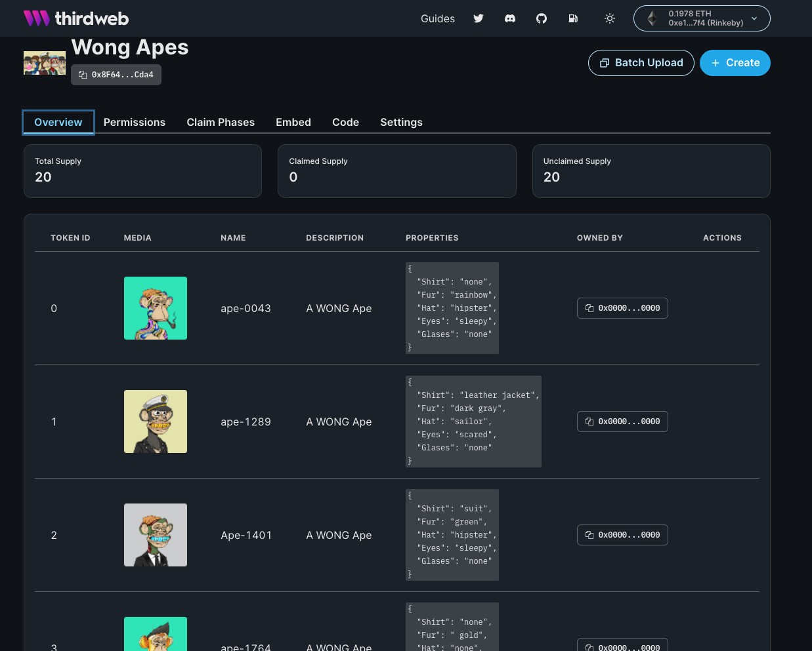
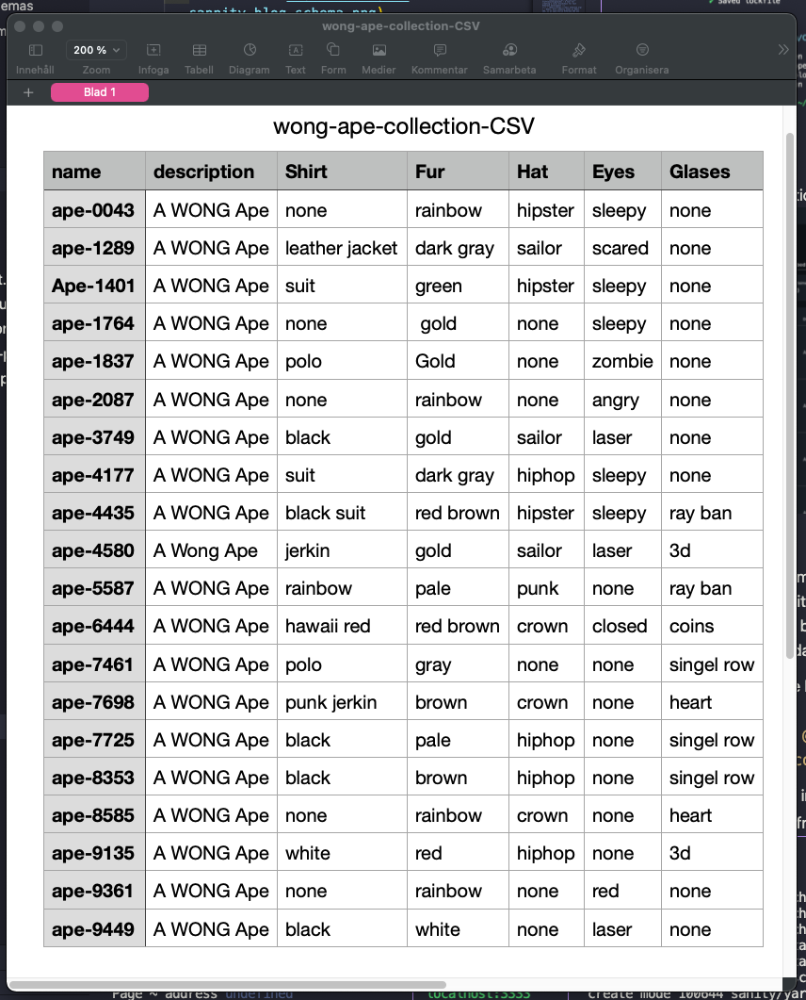
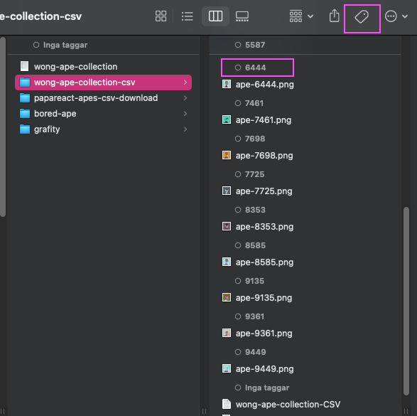
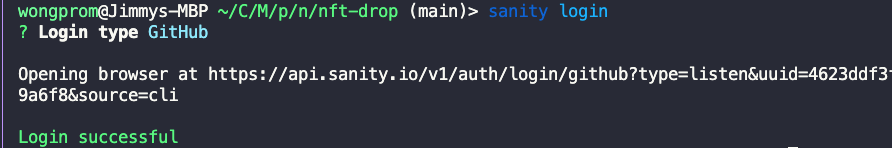
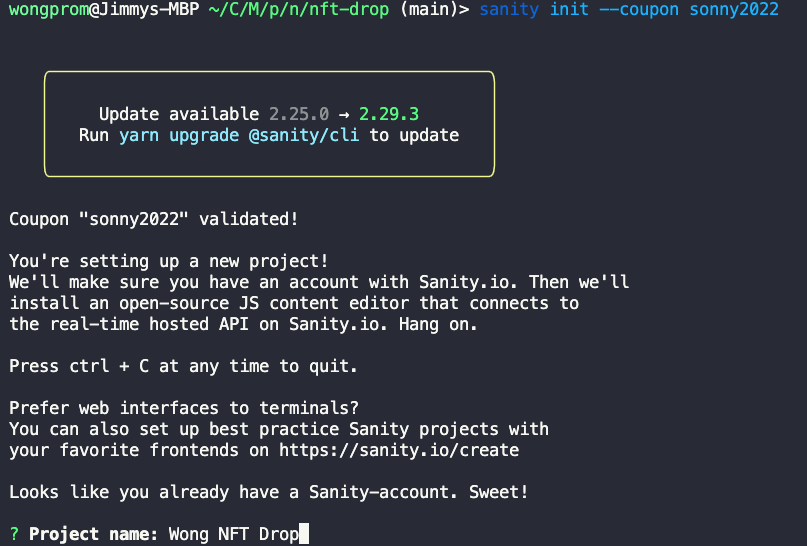
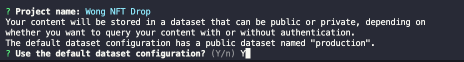
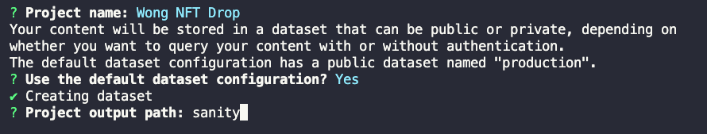
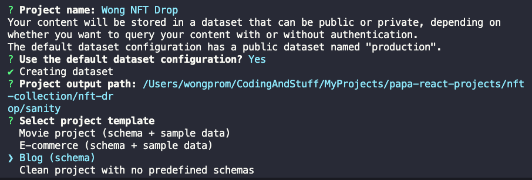
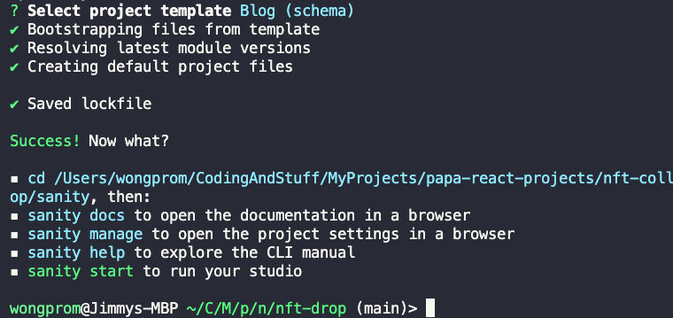
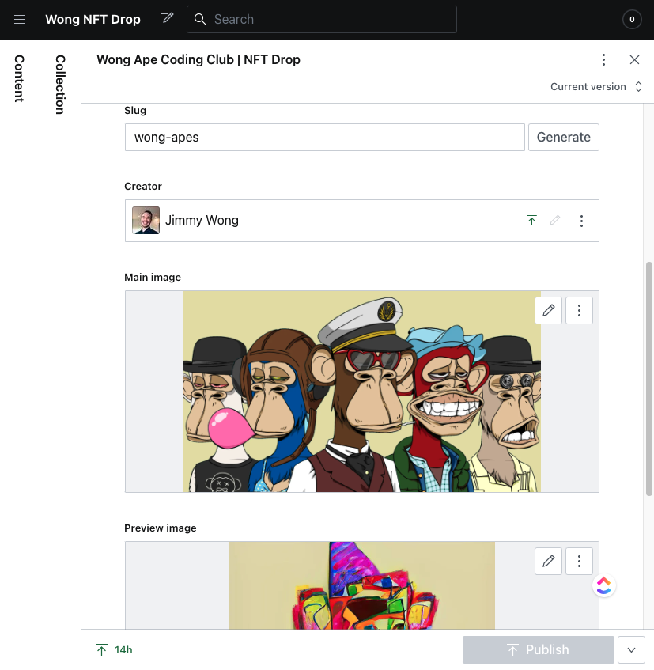

# NFT - drop

NFT collection of images where you can log in with your Metamask
and mint...if there are any left

## Built With

- [NextJS](https://nextjs.org/) - The React Framework
  for Production.
- [TailwindCSS 3](https://tailwindcss.com/) - Rapidly build modern websites without ever leaving your HTML
- [TypeScript](https://www.typescriptlang.org/) - TypeScript is JavaScript with syntax for types.
- [Thirdweb](https://thirdweb.com/) - Smart contracts you control. Tools that accelerate your workflow.
  Intuitive SDKs and widgets for developers.
- [Sanity](https://www.sanity.io/) - Sanity.io is the unified content platform that powers better digital experiences.
- [React Hot Toast](https://react-hot-toast.com/) - Smoking hot React notifications.
  <br>

## Thirdweb

### Add/Create your own collection with thirdweb using .csv file.



### Example structure for CSV file <br>

**Requirements**

- Files must contain one .csv or .json file with metadata. [Download example.csv](https://thirdweb.com/example.csv). [Download example.json](https://thirdweb.com/example.json).
- The csv must have a `name` column, which defines the name of the NFT.
- Asset names _must_ be sequential 0,1,2,3...n.[extension]. It doesn't matter at what number you begin. (Example: `131.png`, `132.png`).<br>

**Options**

- Images and other file types can be used in combination.
- They both have to follow the asset naming convention above. (Example: `0.png` and `0.mp4`, `1.png` and `1.glb`, etc.)
- When uploading files, we will upload them and pin them to IPFS automatically for you. If you already have the files uploaded, you can add an `image` and/or `animation_url` column and add the IPFS hashes there. Download example-with-ipfs.csv<br>
  [Download example-with-ipfs.csv](https://thirdweb.com/example-with-ipfs.csv)<br>
  
  <br>

#### I found it helpful to order the image collection from first to last by tags `tags`<br>



## Sanity

Sanity is the platform for structured content that lets you build better digital experiences. It comes with an open-source editor built in React, Sanity Studio, and a real-time hosted data store, Content Lake.
<br>

Get started with the boosted free plan: [sanity.io/sonny](https://www.sanity.io/sonny)<br>
`npm install -g @sanity/cli`<br>
`sanity init --coupon sonny2022`

#### What does the plan include?

We've doubled the free included monthly usage to:

- 200k API requests
- 1M API CDN requests
- 20GB Bandwidth.
- You also get unlimited admin users so you and your whole team can try it out – be it for your own website, app project, podcasting backend, or whatever one can use a real-time graph-based API for.

## Getting Started

### Connect Sanity

1. `npm install -g @sanity/cli`
   <br>
   or
   <br>
2. `yarn add -g @sanity/cli`
3. `sanity login`
   
   <br>
4. `sanity init --coupon sonny2022`
   
5. Project name: Wong NFT Drop  
   
6. Use the default dataset configuration? Y  
   
7. Project output path: (just type, "Sanity" and press enter)
   
8. Select project template? Blog (schema)
   
9. Done!

### Useful links

- [https://docs.thirdweb.com/react](https://docs.thirdweb.com/react) - The thirdweb React SDK provides a collection of hooks to use in your React apps to interact with your thirdweb contracts.
  <br>
- [Google drive](https://drive.google.com/drive/folders/1qU7Wfv0hDGGULe9b9z_TVMkK1G3nIacv) - with images and .csv file for Thirdweb
  <br>
- [My Sanity Studio](https://wongs-nft-collections.sanity.studio/) - Live Link to Collections.
  <br>

## Useful commands

```
CREATE NEXT.JS APP WITH TAILWINDCSS3
npx create-next-app --example with-tailwindcss YOUR-APP-NAME-HERE
```

```
SANITY
yarn add -g @sanity/cli
or
npm install -g @sanity/cli

sanity login

sanity init --coupon sonny2022

yarn add next-sanity @sanity/image-url
or
npm install next-sanity @sanity/image-url

sanity start (cd in to /sanity folder first)

sanity deploy (cd in to /sanity folder first)
```

# Acknowledgments

Big thanks to Sonny and crew, that created this amazing content.

- [Sonny Sangha](https://www.youtube.com/channel/UCqeTj_QAnNlmt7FwzNwHZnA) - YouTube
- [PapaReact](https://www.papareact.com/) - Website
